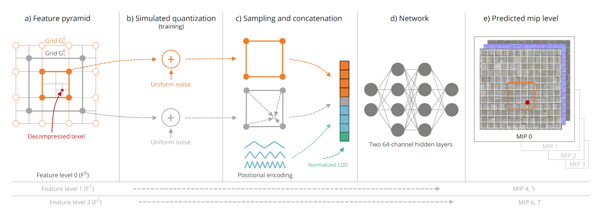
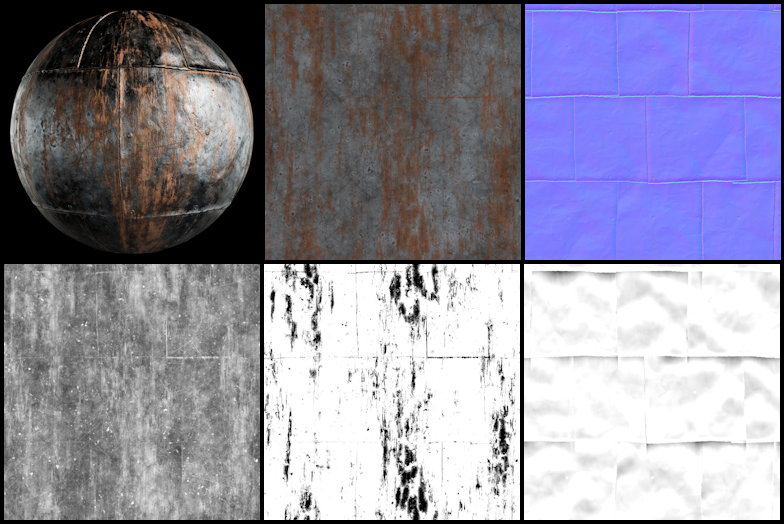

# RTX Neural Texture Compression (NTC) SDK v0.7.0 BETA

[Quick Start Guide](#quick-start-guide)

## Introduction

Neural Texture Compression (NTC) is an algorithm designed to compress all PBR textures used for a single material together. It works best when the texture channels are correlated with each other, for example, detail in the albedo texture corresponds to detail in the normal texture. Up to 16 texture channels can be compressed into one NTC texture set. Typical PBR materials have 9-10 channels: 3x albedo, 3x normal, metalness, roughness, ambient occlusion, opacity.

During compression, the original texture data is transformed into a combination of weights for a small neural network (decoder) and a tensor of latents or features that are sampled and passed through the decoder to reconstruct the texture colors, as is illustrated below. The sampling and decoding processes are fast enough to use them directly in the shaders that normally sample the material textures, such as base pass pixel shaders or ray tracing hit shaders. However, the decoder produces unfiltered data for only one texel, and in order to get filtered textures, we suggest using NTC in combination with [Stochastic Texture Filtering (STF)](https://github.com/NVIDIA-RTX/RTXTF). For renderers targeting lower-end hardware, we suggest implementing the "Inference on Load" mode where NTC textures are decompressed when the game or map is loaded, and transcoded to one of the block-compressed formats (BCn) at the same time. There is also an advanced "Inference on Feedback" mode that uses Sampler Feedback to find the set of texture tiles needed to render the current view and then decompresses only those tiles, storing them in a sparse tiled texture as BCn.



For more background information, please refer to the [Random-Access Neural Compression of Material Textures](https://research.nvidia.com/labs/rtr/neural_texture_compression/) page on the NVIDIA Research website.

### Example Compression Rates

NTC can be thought of as an *adjustable quality/constant bitrate lossy compression scheme*. This means that it will attempt to reconstruct the input images with minimal error while using a fixed amount of data specified as a compression time target. However, unlike block compression schemes (which have a fixed data rate for a given format) the per-texel memory footprint of a NTC-compressed texture bundle will vary based in the specified *Latent Shape* (which is the composite of the number of high- and low-resolution latent channels, the bit-depth of those high- and low-resolution channels, and the scale factor between them). Each latent shape corresponds to a given per-texel bitrate, and thus for a desired compression level a compatible latent shape can be selected which corresponds to desired bitrate as closely as possible. Furthermore, although NTC compression requires specifying a latent shape (and thus bitrate) it is possible to approximate a *constant quality/variable bitrate* approach by performing pre-analysis of the bundle to determine what formats are required to achieve a target quality level. See [Adaptive Compression](docs/SettingsAndQuality.md#adaptive-compression) for more.

To demonstrate how NTC compares to other methods, consider a material defined by the following bundle of material textures:

* Albedo Color (RGB)
* Normal (XY)
* Roughness
* Metalness
* Ambient Occlusion Factor



*Example material from [MetalPlates013 from AmbientCG](https://ambientcg.com/view?id=MetalPlates013)*

Assuming 8 bits per channel and optimal channel packing, this corresponds to a bitrate of 64 bits/texel. In a contemporary pipeline this might be block-compressed into one BC7 texture for Albedo (8 bits/texel), one BC5 texture for normals (4 bits/texel), and a third BC7 texture for Roughness, Metalness, and Ambient Occlusion packed as separate channels (for another 8 bits/texel). For NTC we have found that many real-world texture bundles of this format can be compressed with results comparable to BCn (a PSNR of 40 to 50 dB) with a latent shape requiring about 3 bits/texel.

If we assume a 2k-by-2k texture resolution (and ignore the mip chains) we can compute the texture footprint of the bundle at various points in the data pipeline:

| Bundle Compression | Disk Size | PCI-E Traffic | VRAM Size |
|:-------------------|----------:|--------------:|----------:|
| Raw Image          | 32.00 MB  | 32.00 MB      | 32.00 MB  |
| BCn Compressed     | 10.00 MB  | 10.00 MB      | 10.00 MB  |
| NTC-on-Load*       |  1.52 MB  |  1.52 MB      | 10.00 MB  |
| NTC-on-Sample      |  1.52 MB  |  1.52 MB      | 1.52 MB   |

*: Assumes transcoding to equivalent BCn formats at decompression time.

See the [Settings and Quality Guide](docs/SettingsAndQuality.md) to learn more about various NTC settings and how they affect compression ratios and image quality.


### Cooperative Vector and Inference

Decompressing texels with NTC requires reading the latent data corresponding to a given texture coordinate and then performing an *inference* operation by running it through a small Multi-Layer Perceptron (MLP) network whose weights are determined during compression and stored as part of the compressed bundle. While this operation is modest relative to the massive networks employed by many other deep learning applications it still carries a significant computational cost relative to the average pixel shader commonly seen in 3D rendering applications. Fortunately, NTC is able to benefit from new [Cooporative Vector](https://registry.khronos.org/vulkan/specs/latest/man/html/VK_NV_cooperative_vector.html) extensions for Vulkan and Direct3D 12 which allow pixel shaders to leverage the same hardware acceleration used in large network inference. On Ada- and Blackwell-class GPUs this provides a 2-4x improvement in inference throughput over competing optimal implementations that do not utilize these new extensions.

In order to provide robust backwards compatibility, fallback implementations of the inference code using the `DP4a` instructions or regular integer math have also been provided. This will allow for the decompression code to be executed reliably on any platform that supports at least Direct3D 12 Shader Model 6; however, there will be substantial performance improvements on newer GPUs. See [System Requirements](#system-requirements) for more details.

> ### WARNING: Pre-Release Feature Dependency for Direct3D 12
> NTC texture decompression for DX12 applications, both on-load and on-sample, relies on a preview version of the [Microsoft DirectX 12 Agility SDK](https://devblogs.microsoft.com/directx/directx12agility/), specifically, `1.717.x-preview`. In order for the [Cooperative Vector](https://devblogs.microsoft.com/directx/cooperative-vector/) extensions to work, the application must enable the `D3D12ExperimentalShaderModels` and `D3D12CooperativeVectorExperiment` features, which require that Windows is configured to  be in the Developer Mode. 
>
> A pre-release NVIDIA GPU driver version 590.26 or later is required for Shader Model 6.9 functionality.
> 
> All non-CoopVec versions of DX12 decompression, as well as all Vulkan versions including CoopVec, are OK to use for shipping.
>
> **The DX12 Cooperative Vector support is for testing purposes only. DO NOT SHIP ANY PRODUCTS USING IT.**

## Quick Start Guide

See the [Build Guide](#build-guide) for instructions on compiling the SDK.

To experiment with how Neural Texture Compression performs with different latent shapes and texture bundles, follow the [NTC Explorer Guide](docs/Explorer.md). A few sample material sets have been provided in this package under the `./assets/materials` folder.

To see how NTC works on a sample 3D scene follow the instructions in the [NTC Renderer Guide](docs/Renderer.md) for pre-processing a GLTF scene. A sample scene has been provided under the `./assets/models` folder.

## SDK Contents

| Component | Description | Source code |
|-----------|-------------|-------------|
| [LibNTC](https://github.com/NVIDIA-RTX/RTXNTC-Library) | Library that implements neural texture compression, decompression, and BCn encoding | See Component
| [`ntc-cli`](docs/CommandLineTool.md) | Command-line tool for texture compression and decompression | [tools/cli](tools/cli) 
| [NTC Explorer](docs/Explorer.md) | App for interactive experimentation with neural texture compression and a viewer for NTC files | [tools/explorer](tools/explorer) 
| [NTC Renderer](docs/Renderer.md) | Sample app that demonstrates how to render a GLTF model using NTC materials | [samples/renderer](samples/renderer) 
| [BCTest](docs/BCTest.md) | Test app for evaluating the performance and quality of BCn encoders | [support/tests/bctest](support/tests/bctest)
| [`ntc.py`](libraries/ntc.py) | Python module for developing automation scripts that process materials using `ntc-cli` | See Component
| [`test.py`](support/tests/test.py) | Script for basic functional testing of texture compression and decompression | See Component
| [Materials](assets/materials) | Example materials for the CLI tool and Explorer
| [FlightHelmet model](assets/models) | Example model for the Renderer sample

## System Requirements

Operating System:
- Windows 10/11 x64
- Linux x64

Graphics APIs:
- DirectX 12 - with preview Agility SDK for Cooperative Vector support
- Vulkan 1.3

GPU for NTC decompression on load and transcoding to BCn:
- Minimum: Anything compatible with Shader Model 6 [*]
- Recommended: NVIDIA Turing (RTX 2000 series) and newer.

GPU for NTC inference on sample:
- Minimum: Anything compatible with Shader Model 6 (will be functional but very slow) [*]
- Recommended: NVIDIA Ada (RTX 4000 series) and newer.

GPU for NTC compression:
- Minimum: NVIDIA Turing (RTX 2000 series).
- Recommended: NVIDIA Ada (RTX 4000 series) and newer.

_[*] The oldest GPUs that the NTC SDK functionality has been validated on are NVIDIA GTX 1000 series, AMD Radeon RX 6000 series, Intel Arc A series._

For Cooperative Vector support on NVIDIA GPUs, please use the NVIDIA Graphics Driver preview version 590.26 or newer for DX12, or at least version 570 for Vulkan. The preview drivers can be downloaded using the following links (require an NVIDIA Developer Program account):

- GeForce GPUs: https://developer.nvidia.com/downloads/shadermodel6-9-preview-driver
- Quadro GPUs: https://developer.nvidia.com/downloads/assets/secure/shadermodel6-9-preview-driver-quadro

For a list of software components needed to build the SDK, please refer to the [Build Guide](##Building NTC SDK).

## Known Issues

The following issues are observed with NVIDIA Display Driver 590.26:

- Cooperative Vector inference (both on-load and on-sample) using INT8 math is slower than expected on DX12 (bug 5341486)

## Build Guide

NTC SDK supports Windows x64 and Linux x64 targets.

### Windows x64

Building the NTC SDK on Windows requires the following components:

- Visual Studio 2022 (at least the build tools)
- [Windows SDK](https://developer.microsoft.com/en-us/windows/downloads/windows-sdk) (tested with 10.0.26100.0)
- [CMake](https://cmake.org/download) (tested with v3.28 and v3.31)
- [CUDA SDK](https://developer.nvidia.com/cuda-downloads) (tested with v12.8 and v12.9)

Follow the usual way of building CMake projects on Windows:

- Clone the project recursively:
  ```sh
  git clone --recursive https://github.com/NVIDIA-RTX/RTXNTC.git
  ```
- Building using the "x64 Native Tools Command Prompt for VS 2022":
  ```sh
  cd RTXNTC
  mkdir build
  cd build
  cmake ..
  cmake --build .
  ```
- Building using CMake GUI:
  * Set "Where is the source code" to the `RTXNTC` folder
  * Set "Where to build the binaries" to `RTXNTC/build`
  * Configure a solution using `Visual Studio 2022` tools for the `x64` platform.
  * Generate and open the solution in Visual Studio.
  * Build.

Visual Studio Code with CMake Tools extension and Ninja build system works fine, too.

### Linux x64

Building the NTC SDK on Linux requires the following components:

- C++ compiler (tested with GCC 12.2 and Clang 16.0)
- [CMake](https://cmake.org/download) (tested with v3.25 and 3.31)
- [CUDA SDK](https://developer.nvidia.com/cuda-downloads) (tested with v12.4)
- Some development packages, approximately:
  ```sh
  sudo apt-get update
  sudo apt-get install build-essential cmake libx11-dev libxrandr-dev libxinerama-dev libxcursor-dev libxi-dev
  ```

Follow the usual way of building CMake projects on Linux:

- Clone the project recursively:
  ```sh
  git clone --recursive https://github.com/NVIDIA-RTX/RTXNTC.git
  ```
- Create the build folder, configure and build:
  ```sh
  mkdir build && cd build
  cmake ..
  make -j
  ```

## Integration Guide

The SDK provides several tools for incorporating NTC into a content pipeline and engine runtime.

The `LibNTC` library provides all functionality necessary to compress, serialize/deserialize, and decompress texture sets using whatever hardware acceleration is available. It also provides implementation of a GPU-based BCn encoder to allow for transcoding decompressed textures into block-compressed format at load time, as well as a shader library demonstrating how to decompress bundle texels directly in pixel shaders at sample time.

Additionally, the `ntc-cli` tool can be included as part of any script-based pipelines if that is preferable. This tool is based on `LibNTC` as well and can perform compression and decompression tasks as desired. For more information on syntax please consult the [NTC Command-Line Tool Documentation](docs/CommandLineTool.md). Texture bundle information can be specified directly from the command line; however, the `ntc-cli` tool can also be given a [Bundle Manifest File](docs/Manifest.md) which encodes image file path, semantic and formatting information, and desired transcoding formats into one conveient serialized object. Your content pipeline can either track this information using its own database or used the provided manifest format as desired.

Further details about specific usages of `LibNTC` can be found divided by topic in the following guides, which walk through a proposed pipeline for a typical NTC application:

1. Library Initialization
    * [Installing LibNTC into your project](docs/integration/Installation.md)
    * [Initializing the context](docs/integration/Context.md)
2. Compression
    * [Compressing using LibNTC](docs/integration/Compression.md)
    * [Compression using the `ntc-cli` tool](docs/CommandLineTool.md)
    * [Texture Bundle Manifest Specification](docs/Manifest.md)
3. Decompression
    * On Load
        * [Decompressing texture sets with graphics APIs](docs/integration/InferenceOnLoad.md)
        * [Transcoding to BCn and image comparison](docs/integration/BlockCompression.md)
    * On Sample
        * [Inference on Sample using Cooporative Vector](docs/integration/InferenceOnSample.md)
    * On Feedback
        * See the [Inference on Feedback section](docs/Renderer.md#inference-on-feedback-mode) in the Renderer's Readme file.

The [NTC Explorer](docs/Explorer.md) and [NTC Renderer](docs/Renderer.md) samples demonstrate using `LibNTC` for compression and decompression and can be used as a further reference for what an integrated content workflow might look like.


## Support

Please use GitHub issues or email [rtxntc-sdk-support@nvidia.com](mailto:rtxntc-sdk-support@nvidia.com) for developer support.

## License

[NVIDIA RTX SDKs LICENSE](LICENSE.txt)

This project includes NVAPI software. All uses of NVAPI software are governed by the license terms specified here: https://github.com/NVIDIA/nvapi/blob/main/License.txt