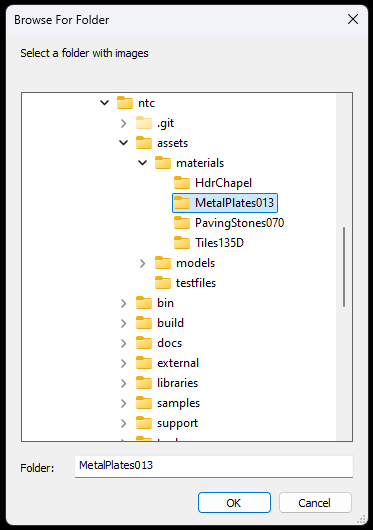
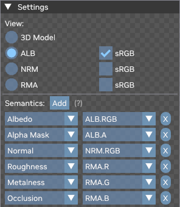
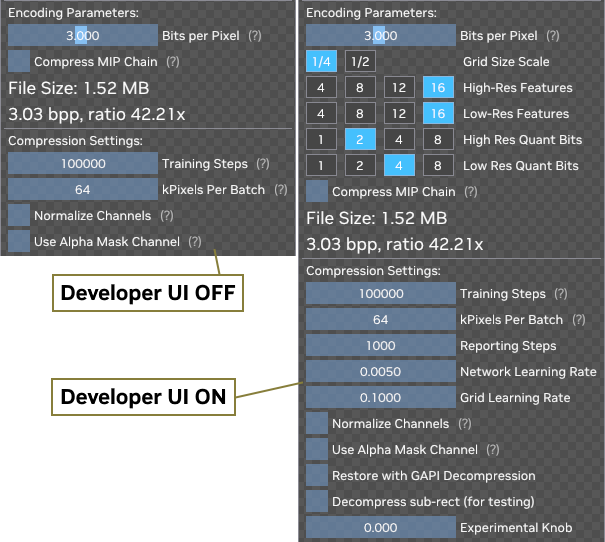
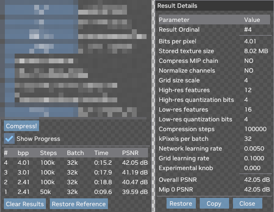
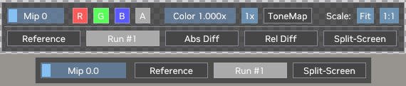
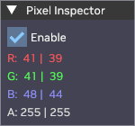

# NTC Explorer

Explorer's main purpose is to load some material textures and allow the user to compress them with various parameters, and to visually compare the compression results against the inputs. Textures can be displayed individually, as 2D images, or used as PBR inputs for a simple 3D plane with basic lighting.

To load a texture set into the Explorer, use the `File > Load Images from Folder...` or `File > Load Images with Manifest...` commands. Alternatively, you can specify the folder path on the command line. Sample materials have been provided in the SDK in `./assets/materials`.

For a description of manifest file format, see the [Manifest specification](Manifest.md).

Explorer looks at the file names of the loaded images and tries to guess which PBR semantics are encoded in each image. The specific parts of file names are shown at the top of the Settings window, and the semantics below them. When it cannot guess right, the right semantics and color spaces should be provided through the UI:

The `Encoding Parameters` section allows you to configure the settings that affect the compressed file size using either the `Bits per Pixel` slider or explicitly using the 5 settings that control the feature grid. Note that the `Bits per Pixel` value here is computed for a single mip level, and encoding the entire mip chain at once is more efficient, so the bpp values that you'll ultimately get when compressing the mip chain will be lower.

The `Compression Settings` section has other parameters that affect compression performance and output quality but do not affect the file size.

Some parameters in these sections are normally hidden, unless `Developer UI` is enabled in the `Options` menu.

The bottom part of the Settings window shows the experiment log - a list of compression results. Clicking on a result will open a window with all the parameters used for that compression run. From that window, you can restore the parameters from that compression result into the main UI and restore the compressed image into the image view.

Both 2D and 3D image views have settings windows at the bottom of the screen. On the image below, the 2D view controls are shown at the top, and the 3D view controls are at the bottom. The 2D view allows you to choose the channels to display, set the color amplification factor, enable tone mapping, and adjust image scaling. Also, the 2D view lets you select a difference view: it can display the absolute or relative difference of the two images (`Reference` and `Run #1` on the screenshot), or show them both in a split-screen way. Use the right mouse button to adjust the split position.

Both view types have two image slot buttons (again, `Reference` and `Run #1` on the screenshot). You can drag  compression results from the Results list onto any of these buttons, which allows you to compare between two compression runs. To restore one of the views to the input (reference) images, use the `Restore Reference` button in the Results window, or drag that button onto the desired image slot.

The last UI element is the Pixel Inspector on the top-right. It shows raw RGBA values for the pixel under the mouse pointer in both left and right image slots, regardless of the view mode. If the active image has `UNORM8` pixel format, the values are shown as integers; otherwise, they are shown as floating-point values.

